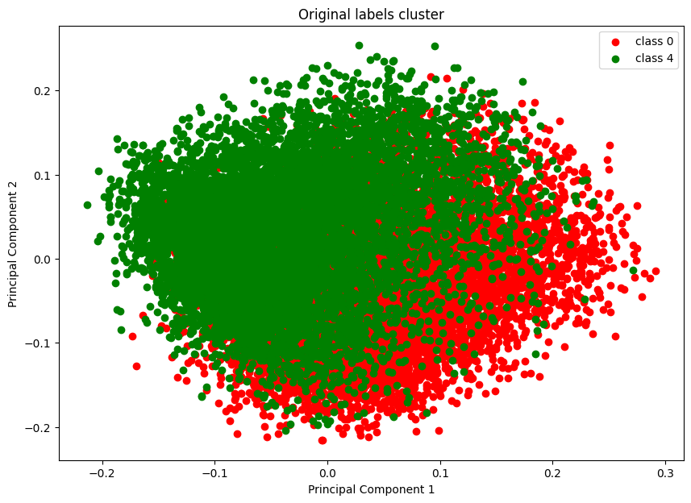
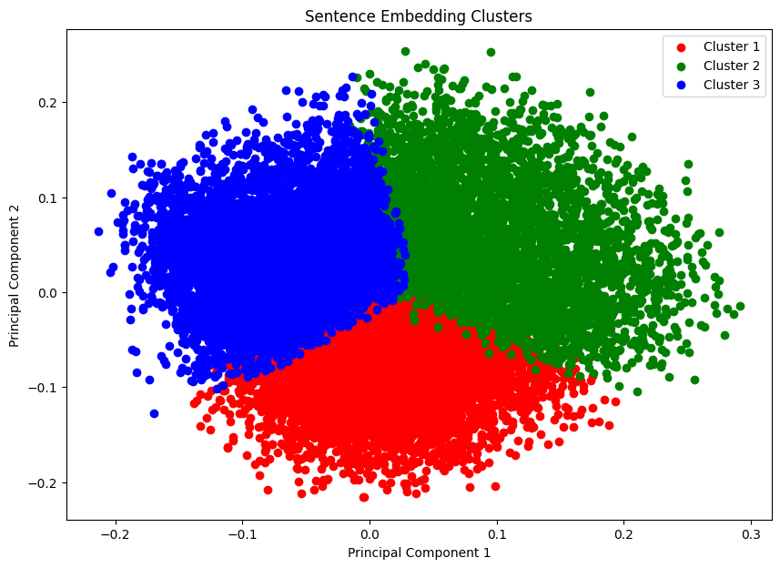
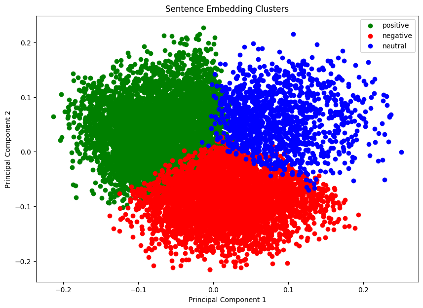

# Sentiment detection model training details

After initial look at provided dataset, it was clear that there was no tagging for neutral tweets in the data, but it was expected by testing data. 

By manually reviewing sample training dataset, I made the hypothesis that data in mislabeled and most of the neutral sentences are tagged positive/negative. Manually reviewing 1.6Mn lines and correcting labels is not feasible. Hence I automated label correction by using following method.
1. create embedding of vector by using any dense encoder model, I choose `thenlper/gte-base` because of the small size and good clustering score on [MTEB Leaderboard](https://huggingface.co/spaces/mteb/leaderboard)
2. I took sample of data around `10%` of training data, randomly sampled and created vectors of it using `gte-base` model.
3. Due to I dimensionality of vectors (768 dim), I used PCA to find 2 major components and plot it.

4. There are lots of overlapping points for positive and negative cluster. To check if there these overlap points are neutral vectors, I used `KNN` with `3` classes to reassign cluster. 

5. With KNN, I was able to segregate all vectors into 3 clusters. Hence, it is proved that there are 3 classes in training data and most of them are mislabeled.
6. To reverify my hypothesis, I again performed following steps
    - plot points which are originally labeled as positive and are in positive cluster
    - plot points which are originally labeled as negative and are in negative cluster
    - For neutral points, I used off the shelf model `finiteautomata/bertweet-base-sentiment-analysis` for verifying if points in 3rd cluster are actual neutral or not. Finally I plotted neutral points which are being predicted as neutral by off the shelf model. Here is the viz

7. From the above image, it is clear that there are three classes, and by clutering subset of data and then using them to relabel entire data can fix mislabeling to acceptable label.
8. Here's are few examples from relabeled data
```
Text: Back at work
Original Label: negative
Predicted Label: neutral
```
```
Text: I won't get there til 8.30 earliest
Original Label: negative
Predicted Label: neutral
```
```
Text: Good Morning back to you! A cloudy day here also....
Original Label: positive
Predicted Label: neutral
```
9. Once labeling is corrected. I used same vectors as features/input to train `LogisticRegression` and `SVM` classifier. 
